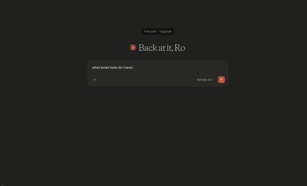
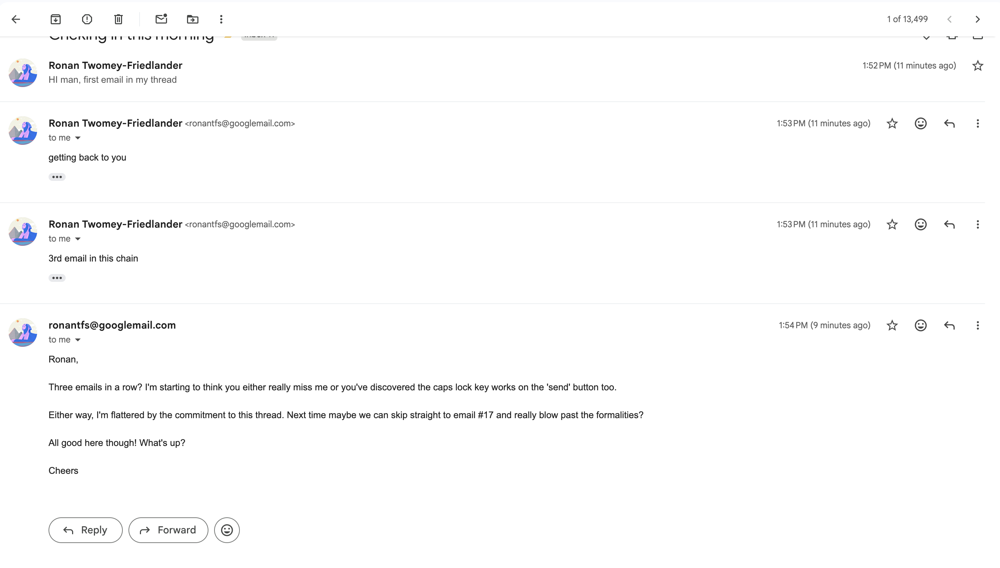

# System requirements: 
MCP SERVER:
- uv  (if using my setup commands below)
- python3.14
- Gmail Authentication - configured in GCP. 

MCP Client: 
- The MCP server should work with any MCP client,
 this was tested using Claude Desktop as the MCP Client. 
 See below for Claude Desktop set up.

# 1: LOCAL INSTALL, with UV:
```shell
uv venv
source .venv/bin/activate
uv pip install -e .
```

## CLAUDE DESKTOP SET UP

### how to locate config macOS:
1) finder
2) ''' cmd shift G '''  --> ~/Library/Application Support/Claude/claude_desktop_config.json

### Example config: 
```json
{
    "mcpServers": {
        "email": {
            "command": ".../AI_institute_fundation_project_email/.venv/bin/python3.14",
            "args": [
                ".../AI_institute_fundation_project_email/mcp_email/email_server.py"
            ],
            "env": {
                "TOKEN_FILE": ".../AI_institute_fundation_project_email/token.json",
                "CLIENT_SECRET_FILE": "...AI_institute_fundation_project_email/gmail_credentials.json"
            }
        }
    },
    "preferences": {
        "coworkScheduledTasksEnabled": false,
        "sidebarMode": "chat"
    }
}
```

- "**command**": ".../.venv/bin/python3.14", should point towards python interpreter in your venv (created with "uv venv" shell commands above).
- "**args**" ".../AI_institute_fundation_project_email/mcp_email/email_server.py" should be the absolute path to the email server python in the source code.
- env set environment variables used for connection to gmail API (see google docs for how to generate Google API credentials for gmail API: https://developers.google.com/workspace/gmail/api/quickstart/python)

### Check Claude Desktop has started the server and see our tools: 
0) update config as above
1) quit then start Claude Desktop
3) go to settings -> Desktop app -> Developer
4) should see server name ("email-server") connected 
5) Ask what tools are available.
---

# User guide for our tools 
As specified above in the client config, our mcp server code is found at **mcp_email/email_server.py**

It contains three tools: 
- get_unread_emails
- create_draft_reply
- send_thread_reply



Each tools has a clear description in the MCP tool registry, but an overview of expected user flow is illustrated below: 
In chat with MCP client, [u]: user, [c]: MCP client, [s]: MCP server: 

#### i) Checking available tools:
1) [u->c]: "What email tools are available?"
2) [c->s]: "tools/list" request
3) [s]: list_tools()
4) [s->c]: list[types.Tool]
5) [c_u]: "you have three tools available: 1) get_unread_emails, ..."


#### ii) Checking unread emails:
1) [u->c]: "what unread emails do I have?"
2) [c->s]: `tools/call` request with `{"name": "get_unread_emails", "arguments": {}}`
3) [s]: call_tool("get_unread_emails", {})
4) [s->c]:  list[types.TextContent] *(text summary content on unread email thread_ids, sender, subject )
5) [c_u]: "you have 5 unread email threads from the last few days: 1) From Amazon ..."


#### iii) Drafting a reply:
1) [u->c]: "great, please draft me a reply to Amazon"
2) [c->s]: `tools/call` request with `{"name": "create_draft_reply", "arguments": {"threadId": "XXXXXXXX"}}`
3) [s]: call_tool("create_draft_reply", {"threadId": "XXXXXXXX"})
4) [s->c]: list[types.TextContent] *(JSON payload with instructions, threadId, and messages array)
5) [c->u]: "Here's a draft reply: [generated reply text based on thread context, e.g. "Dear Amazon Team, ..."]"

#### iv) Sending the reply:
1) [u->c]: "use the thread reply tool to send the reply"
2) [c->s]: `tools/call` request with `{"name": "send_thread_reply", "arguments": {"threadId": "XXXXXXXX", "replyText": "Dear Amazon Team, ..."}}`
3) [s]: call_tool("send_thread_reply", {"threadId": "xxxx", "replyText": "Dear Amazon Team, ..."})
4) [s->c]: list[types.TextContent] *("Reply sent successfully")
5) [c->u]: "Your reply has been sent successfully!"

#### iv) Go to Gmail and check ! 
